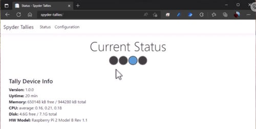

# SpyderTallyController
Hi there!  This repository contains source code and information for building a Tally controller device designed for use with the Spyder video processor.  The core of the project is based around the Raspberry Pi single-board computer.  Check out the associated blog post on this project [here](https://www.knightware.net/?p=4086) for help building your own device.

|  |  |
|:---:|:---:|
| Tally Front View | Tally Open Top View |

|  |  |
|:---:|:---:|
| Web Status Page | Web Configuration Page |

## Key Features and Overview
* Works with Spyder 200 / 300 / X20 / X80 / Spyder-S hardware
* Works with every major release version of Spyder software
* Supports different servers and rules per individual tally
* Built-in web server for remote configuration and monitoring
* Front panel shows device IP and on/off tally icons for quick viewing of status

If you have a Spyder video processor of any generation, this device will work as a tally controller for that processor. For those wondering what tallies are, imagine a live show where multiple cameras are pointed at talent on a stage. Lights are usually physically positioned on top of the cameras and light up when a camera is ‘live’ to help the talent know which camera they should be looking at. The tally controller described here contains relays (electronically controlled contact closures) which open and close when specific sources are shown or hidden in windows on Spyder.

The video below walks through the device hardware and software, providing an overview and demo of the project for those of us out there who prefer to consume video content.

Building your own Device
=================
All the instructions needed to get a device built and programmed are contained as a blog post on my Knighware.net website, and you can view that post [here](https://www.knightware.net/?p=4086).  The post walks through the hardware needed to build your own device, the wiring for that hardware, and even configuring an SD card image containing the configured tally application.

Some Useful Links
=================
* [Building a Spyder Tally Controller](https://www.knightware.net/?p=4086) - Blog post on knightware.net containing instructions for building your own device
* [YouTube - Building a Spyder Tally Controller](https://youtu.be/8xSgcWn2_8I) - (Updated) Focuses on the updated hardware and software
* [YouTube Video - Building a Spyder Tally Controller](https://youtu.be/mBM5LXhSECg) - (Original) Covers older version of Tally controller, but contains a lot of theory and background on Spyder tech that is still very relevant
* [Spyder Client Library](https://www.nuget.org/packages/SpyderClientLibrary/) - this is the library powering communication with Spyder; useful for all kinds of projects and software applications
