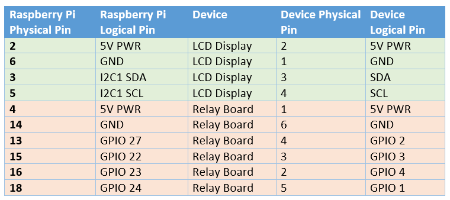
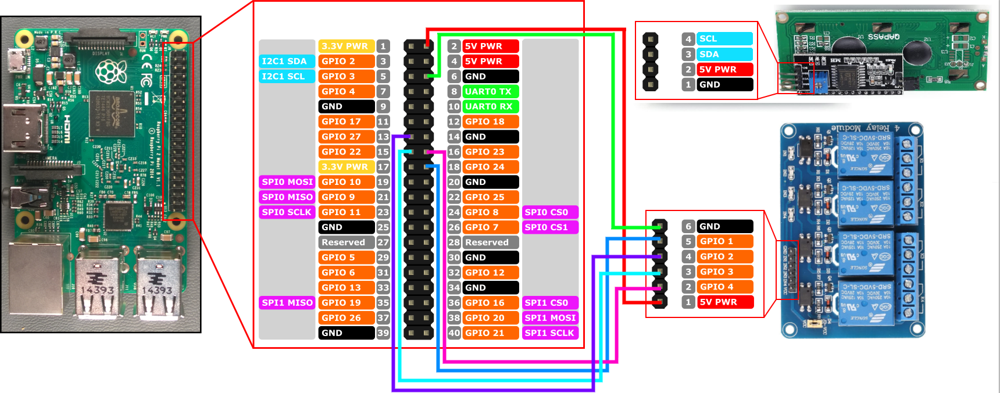

# Wiring up the Raspberry Pi (4-relay version)

This doc shows how to wire up the Raspberry Pi to the 4-relay version of the device. The wiring is the same for the 8-relay version, but you will have more relays to connect.
This docuemnt assumes you have the following components:
- Raspberry Pi (any model with GPIO pins will work, but the 4-relay version is designed for the Raspberry Pi 4)
- 4-relay module (or 8-relay module if you are using the 8-relay version)
- Jumper wires
- Power supply for the Raspberry Pi (and the relay module if it requires a separate power supply)
- LCD Display (you can skip this if you are not using an LCD display)

## Overal Wiring Pinout

The Raspberry Pi GPIO pins are used to control the relay module and the LCD display. The pinout is as follows:

## Wiring the Relay Module

Follow the connection diagrams below to connect the relay module to the Raspberry Pi:

## Wiring the LCD Display

If you are using an LCD display, connect it to the Raspberry Pi as follows:

